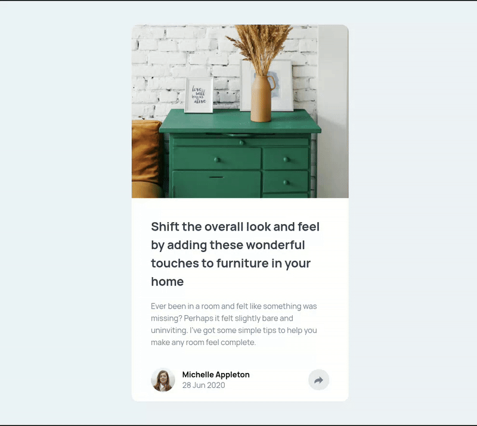
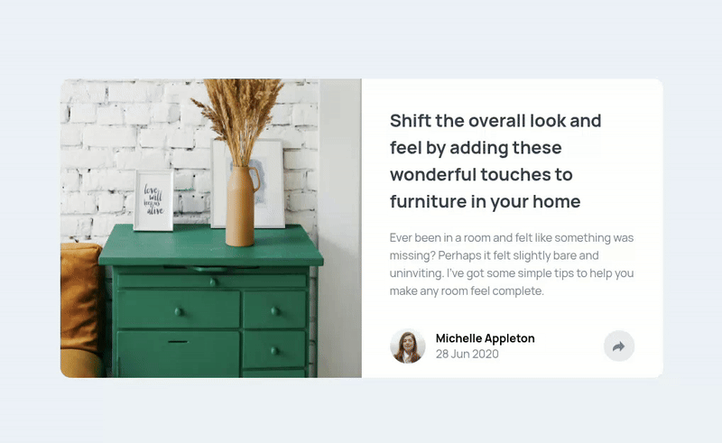

# Frontend Mentor - Article preview component solution

This is a solution to the [Article preview component challenge on Frontend Mentor](https://www.frontendmentor.io/challenges/article-preview-component-dYBN_pYFT). Frontend Mentor challenges help you improve your coding skills by building realistic projects. 

## Table of contents

- [Overview](#overview)
  - [The challenge](#the-challenge)
  - [Screenshot](#screenshot)
  - [Links](#links)
- [My process](#my-process)
  - [Built with](#built-with)
  - [What I learned](#what-i-learned)
  - [Useful resources](#useful-resources)
- [Author](#author)
- [Acknowledgments](#acknowledgments)


## Overview

### The challenge

Users should be able to:

- View the optimal layout for the component depending on their device's screen size
- See the social media share links when they click the share icon

### Screenshot

## Mobile preview

## Desktop preview


### Links

- Solution URL: [Solution](https://your-solution-url.com)
- Live Site URL: [Live site](https://your-live-site-url.com)

## My process

### Built with

- Semantic HTML5 markup
- CSS custom properties
- Flexbox
- Mobile-first workflow
- Javascript DOM manipulation
- Media queries 

### What I learned

I learnt how the clamp property works and how to use it.
I learnt how the filter property works. The 'chg-img-filter' class manipulates the image background to create a cut-out effect.
```css
  font-size: clamp(1.6rem, 1.6rem, 4rem);

  .chg-img-filter {
    filter: brightness(200%) contrast(200%);
}
```
This code demonstrates how I learnt to manipulate styles and classes according to screen size using JavaScript.
```js
  if (window.innerWidth < 1024) { 
      avtCtnr.classList.toggle('hide');
      loopIconsMobile('toggle');
      shareImg.classList.toggle('chg-img-filter');
      changeBtnBackground('--grayishBlue')
      shareCtnr.classList.toggle('chg-background');
  } 
  else {
      shareImg.classList.toggle('chg-img-filter');
      changeBtnBackground('--veryDarkGrayishBlue');
      iconsDesk.classList.toggle('hide')
  }
```

### Useful resources

- [MDN Documentation](https://developer.mozilla.org/en-US/) - This helped me to gain more knowledge about CSS properties and how to use them.

## Author

- Frontend Mentor - [@viniciusfrsantos2](https://www.frontendmentor.io/profile/viniciusfrsantos2)


## Acknowledgments

I'm happy to learn about the filter property and how to adjust styles according to screen size using JavaScript.